# 🧠 Multimodal Classification Training Platform

An end-to-end **multimodal Classification Model** with a Streamlit UI, a Django REST API, and a containerized PyTorch trainer that runs on **AWS ECS Fargate**. It demonstrates dataset intake, automated metadata detection, parameterized training jobs, secure callback reporting, and artifact management.

🌍 **Live Demo (no setup needed):**
**[https://meysam.ngrok.pro](https://meysam.ngrok.pro)**

---

## ✨ Highlights

* **Frontend (Streamlit)** – wizard for data upload/selection, config (splits, epochs, LR), and results.
* **Backend (Django + DRF)** – datasets, detection results, training jobs, metrics, artifacts.
* **Trainer (PyTorch)** – containerized training on **ECS Fargate**, env-driven config.
* **S3 Integration** – download inputs, upload artifacts (`.pt`, `id2label.json`).
* **Secure metrics callback** – HMAC-signed `PATCH` to `/training_jobs/{id}/metrics/`.
* **CI/CD** – GitHub Actions builds & pushes Docker to ECR and keeps a **fixed Task Definition revision** that always pulls the **latest** image.
* **Pluggable models** – add `ml/models/<your_model>/train.py` and select via `MODEL` env.

---

## 🏗️ System Architecture

The Streamlit frontend lets users either **upload a new dataset** or **pick an existing one**. For uploads, the Django REST API immediately persists metadata in **PostgreSQL** and begins **background staging to S3** while the user chooses training options; selecting an existing dataset skips any upload. When the user submits, the backend launches a **containerized PyTorch trainer** on **ECS Fargate** (one-off `RunTask`), passing the chosen configuration via environment variables. The task **downloads inputs from S3**, trains, **uploads artifacts** (e.g., `model.pt`, `id2label.json`) back to S3, and **reports metrics** to the API using a short-lived **HMAC-signed callback**; logs stream to **CloudWatch**. The frontend **polls the API** for live metrics and results. This design cleanly separates concerns (UI, control plane, data plane), keeps compute **stateless**, and scales by **fanning out independent training tasks**.

```mermaid
flowchart LR
    User([👤 User]) --> FE[Streamlit Frontend]
    FE -->|Submit Job| BE[Django Backend API]

    %% Orchestration
    BE -->|RunTask| ECS[ECS Fargate Task]

    %% Data flow to S3
    BE -->|Upload Assets| S3[(Amazon S3)]
    S3 -->|Download Assets| ECS

    %% Training outputs
    ECS -->|Upload Artifacts| S3
    ECS -->|PATCH metrics| BE
    BE --> FE

    %% Observability
    ECS -->|Logs & Monitoring| CW[CloudWatch]

    %% Persistence
    BE <--> |"ORM (DRF Models)"| PG["(PostgreSQL / RDS)"]

    style FE fill:#f6d365,stroke:#333,stroke-width:2px
    style BE fill:#ffb347,stroke:#333,stroke-width:2px
    style ECS fill:#8fd3f4,stroke:#333,stroke-width:2px
    style S3 fill:#90ee90,stroke:#333,stroke-width:2px
    style CW fill:#dda0dd,stroke:#333,stroke-width:2px
    style PG fill:#ffd1dc,stroke:#333,stroke-width:2px
```



### 🔄 ML Pipeline

**High-level flow (train.py):**
Loads CSV and cleans text → builds a full MultiModalDataset → random-splits into train/val → fits a TabularNormalizer and categorical encoders on **train only** → recreates train/val datasets with the fitted normalizer → sets up DataLoaders → builds the multimodal model + AdamW + ReduceLROnPlateau → trains per epoch (loss/backprop, train accuracy) → periodically evaluates (val loss/accuracy, confusion matrix), steps the scheduler, logs metrics → tracks and saves the **best** model by val accuracy (also computes precision/recall/F1) → reloads best weights → returns a `TrainingReport` (logs + best metrics) and `Artifacts` (state\_dict, `id2label`).


* **Train/val split** uses `random_split` on the base dataset indices.
* **Categorical encodings & normalization** are fit **only on the train split** and reused for val.
* **Scheduler** steps on `avg_val_loss`.
* **Best checkpoint** selected by `val_acc`, with `precision/recall/f1` computed from the best val confusion matrix.
* Final return: `TrainingReport(logs+metrics)`, `Artifacts(model.state_dict, id2label, model_type='pt')`.

---

## 📦 Repository Layout

```
multimodal_demo/
├─ backend/                   # Django + DRF API
│  ├─ registry/               # apps: models, serializers, views, urls
│  ├─ services/               # ECS training setup
│  ├─ .env                    # not in repo. should be added by you!
│  └─ requirements.txt
├─ frontend/                  # Streamlit UI
│  ├─ main.py                 # pages, routing, API calls
│  ├─ ...              
│  └─ requirements.txt
├─ ml/                        # Trainer container (runs on ECS or local)
│  ├─ main.py                 # config → download → train → report → upload
│  ├─ config.py               # Pydantic settings (env-driven)
│  ├─ utils/
│  │  ├─ params_builder.py    # builds DLTrainingParameters from env + assets
│  │  ├─ storage.py           # S3 download/upload with boto3
│  │  └─ authentication.py          # HMAC token builder for metrics callback
│  ├─ models/
│  │  ├─ multimodal/train.py  # example trainer (def train(...))
│  │  └─ dummy_model/train.py # sample toy trainer
│  ├─ entrypoint.sh           # installs model requirements + runs main.py
│  ├─ .env                    # not in repo. should be added by you!
│  └─ Dockerfile
├─ .github/workflows/         # GitHub Actions CI/CD
│  └─ ml-ci.yml
└─ README.md
```

---

## 🔧 Prerequisites

* **Python 3.12+** (for local BE/FE dev)
* **Docker** (for trainer container)
* **AWS**:

  * ECR repo (e.g., `ml-trainer`)
  * ECS cluster & Task Definition (e.g., `training-family:1`)
  * IAM roles: `ecsTaskExecutionRole` + a task role (S3 access)
  * S3 bucket (datasets + artifacts)
* (Optional) **ngrok** to expose BE/FE for demos

---

## 🚀 Run Locally

### 1) Backend (Django)

```bash
cd backend
python -m venv .venv && source .venv/bin/activate
pip install -r requirements.txt

# Set DB and settings as needed (e.g., Postgres or sqlite)
python manage.py migrate
python manage.py runserver 0.0.0.0:8000
```

### 2) Frontend (Streamlit)

Set API base to your backend. In `frontend/main.py` ensure:

```python
API_URL = "http://localhost:8000"
```

Run:

```bash
cd ../frontend
python -m venv .venv && source .venv/bin/activate
pip install -r requirements.txt
streamlit run main.py --server.port 8501
```

Visit **[http://localhost:8501](http://localhost:8501)**.

---

## ☁️ ECS / CI-CD

### Fixed Task Definition, Rolling Latest Image

* One-time: create a Task Definition revision (e.g., `training-family:1`) whose container image is
  `ACCOUNT.dkr.ecr.eu-central-1.amazonaws.com/ml-trainer:latest`
* **Do not** re-register new TDs every commit.
* CI only builds & pushes `:latest` (and `:<git-sha>`); tasks always pull the new image at start.

### GitHub Actions (simplified)

Key steps in `./.github/workflows/ml-ci.yml`:

* OIDC → assume deploy role
* Build ML image from `ml/Dockerfile`
* Push to ECR as `:latest` + `:<git-sha>`
* (Optional) `aws ecs update-service --force-new-deployment` if you run a service

---

## 🔐 Secure Metrics Callback

**Endpoint (trainer → backend):**

```http
PATCH /api/training_jobs/{job_id}/metrics/
```

**Headers:**

```http
X-Callback-Token: <exp>.<hmac_sha256(job_id.exp, secret)>
```

**Token generation (trainer side – `utils/callback.py`):**

```python
import hmac, hashlib, time

def make_callback_token(job_id: int, secret: str, ttl: int = 900) -> str:
    exp = int(time.time()) + ttl
    msg = f"{job_id}.{exp}".encode()
    sig = hmac.new(secret.encode(), msg, hashlib.sha256).hexdigest()
    return f"{exp}.{sig}"
```

**Backend policy:**

* `GET` allowed.
* `PATCH` requires a valid token (compares HMAC + expiry).

---

## 🌱 Environment Variables (trainer)

| Variable           | Purpose                                                 |
| ------------------ | ------------------------------------------------------- |
| `MODEL`            | Model folder under `ml/models/` (e.g., `multimodal`)    |
| `JOB_ID`           | TrainingJob id (for callbacks/artifacts)                |
| `S3_BUCKET`        | Bucket name for assets & artifacts                      |
| `ASSETS`      | JSON list of `{"key","s3_uri"}` inputs                  |
| `API_BASE`         | Backend API base (e.g., `https://meysam.ngrok.pro/api`) |
| `CALLBACK_SECRET`  | HMAC secret for callback signing                        |
| `CALLBACK_TTL`     | Token TTL (seconds), default `900`                      |
| `WORKDIR`          | Scratch workspace in container, default `/tmp/trainer`  |
| `EPOCHS`           | Training epochs                                         |
| `LEARNING_RATE`    | Learning rate                                           |
| `BATCH_SIZE`       | Batch size                                              |
| `VALIDATION_SPLIT` | Train/val split proportion                              |
| `FEATURE_COLUMNS`  | Dataset schema (JSON list)                              |
| `MODALITY_COLUMNS` | Dataset schema (JSON list)                              |
| `TARGET_COL`       | Target column name                                      |
| `COLUMN_TYPES`     | Column→type mapping (JSON map)                          |

**Example `.env` for local testing:**

```env
S3_BUCKET=multi-modal-demo-meysam
API_BASE=http://localhost:8000/api
CALLBACK_SECRET=super-long-secret
CALLBACK_TTL=900
ASSETS_JSON=[{"key":"train_file","s3_uri":"s3://bucket/datasets/17/metadata.csv"},{"key":"train_folder","s3_uri":"s3://bucket/datasets/17/data/"}]
MODEL=multimodal
EPOCHS=2
LEARNING_RATE=0.0005
BATCH_SIZE=8
VALIDATION_SPLIT=0.2
```

---

## 🔌 Key API Endpoints (backend)

* `POST /api/datasets/upload_and_detect/` → upload CSV/files, detect metadata, stream upload to S3
* `GET /api/datasets/` → list datasets
* `GET /api/datasets/{id}/preview/` → CSV head preview (if uploaded)
* `POST /api/training_jobs/` → create training job (dataset + schema + hparams)
* `POST /api/training_jobs/{id}/start/` → ECS RunTask for this job
* `PATCH /api/training_jobs/{id}/metrics/` → trainer callback (requires `X-Callback-Token`)
* `GET /api/metrics/?job={id}` → fetch metrics for a job
* `GET /api/artifacts/?job={id}` → list artifact URIs

---

## 👀 For Reviewers

Try it live: **[https://meysam.ngrok.pro/](https://meysam.ngrok.pro/)**

This repo shows:

* Multimodal ingestion and column typing
* Strong separation of concerns (FE/BE/Trainer)
* Secure callback channel from compute to API
* CI/CD discipline with immutable images + stable task def
* Extensible model interface (`def train(...)`) for rapid experiments

---
